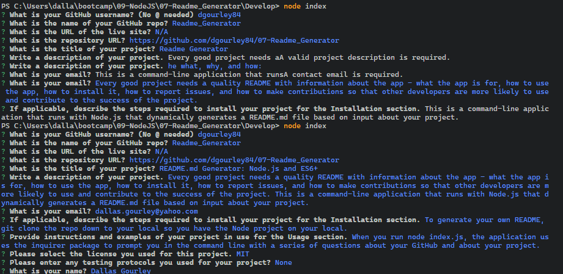

  
# README.md Generator: Node.js and ES6+

  Every good project needs a quality README with information about the app - what the app is for, how to use the app, how to install it, how to report issues, and how to make contributions so that other developers are more likely to use and contribute to the success of the project. 
  
  This is a command-line application that runs with Node.js that dynamically generates a README.md file based on input about your project.
  
  Check out the [create-README.md](create-README.md) in this repo as an example.

  

  Readme_Generator

  [A deployed version can be viewed here.](N/A)

  [The repository can be viewed here.](https://github.com/dgourley84/07-Readme_Generator)

  ---
## Contents
1. [About](#about)
    1. [Usage](#usage)
    2. [User Story](#user-story)
    3. [Acceptance criteria](#acceptance-criteria)
    4. [Visuals](#visuals)
2. [Installation](#installation)
3. [License](#license)
4. [Contributing](#contributing)
5. [Tests](#tests)
6. [Authors and acknowledgment](#authors-and-acknowledgments)
7. [Questions](#questions)
---
## About

  Every good project needs a quality README with information about the app - what the app is for, how to use the app, how to install it, how to report issues, and how to make contributions so that other developers are more likely to use and contribute to the success of the project. This is a command-line application that runs with Node.js that dynamically generates a README.md file based on input about your project.

  ---
## Usage

  When you run node index.js, the application uses the inquirer package to prompt you in the command line with a series of questions about your GitHub and about your project.

  From there, the application will generate markdown and a table of contents for the README conditionally based on your responses to the Inquirer prompts (so, if you don't answer the optional questions, such as Installation, an Installation section will not be included in your README). The README will also include badges for your GitHub repo.

  Finally, fs.writeFile is used to generate your project's README.md file. Check out the [create-README.md](create-README.md) in this repo as an example on the final output.
  
---
## User Story

---
## Acceptance Criteria
  
  

---
## Visuals:
  

  

  

---
## Installation:

  To generate your own README, git clone the repo down to your local so you have the Node project on your local.

  Run npm install in order to install the following npm package dependencies as specified in the package.json:

  - inquirer will prompt you for your inputs from the command line.
  
  The application will start by running node index.js in the command line.

  Answer the prompts in your command line to generate the README.

  After answering all the prompts, your README file will be named 'create-README.md' and will be ready for you at the root of the repo.

  The README has some automatically generated badges for your repo courtesy of shields.io and will include your profile picture & email from GitHub.

---
## License
  License used for this project - MIT
  * For more information on license types, please reference this website
  for additional licensing information - [https: //choosealicense.com/](https://choosealicense.com/).
---

## Contributing:

  To contribute to this application, create a pull request.
  Here are the steps needed for doing that:
  - Fork the repo
  - Create a feature branch (git checkout -b NAME-HERE)
  - Commit your new feature (git commit -m 'Add some feature')
  - Push your branch (git push)
  - Create a new Pull Request
  Following a code review, your feature will be merged.

---

## Methodology

The application utilizes modularization by separating the questions, licence badges and generation of the markdown into separate modules: questions.js, licencBadges.js and generateMarkdown.js, respectively, inside the utils folder.

The application also utilizes, as much as possible, syntax and paradigms introduced in ES6 and beyond, including:

  - Arrow functions,
  - const, let,
  - Template literals, and
  - async/await to handle inquirer and fs.writeFile promises.

---

## Tests:

  None

---
## Authors and Acknowledgments

  Dallas Gourley

---

## Questions:
* GitHub Username: [dgourley84](https://github.com/dgourley84)
* GitHub Email: (dallas.gourley@yahoo.com)

